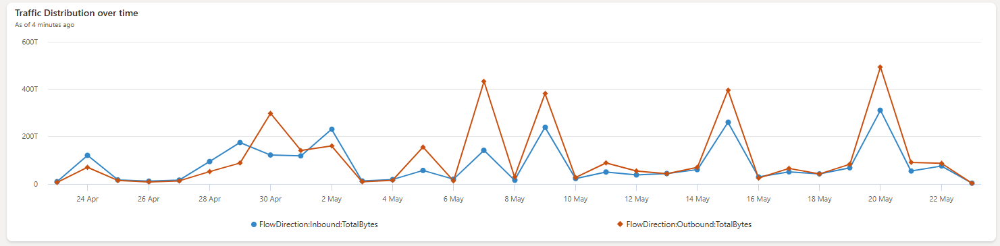
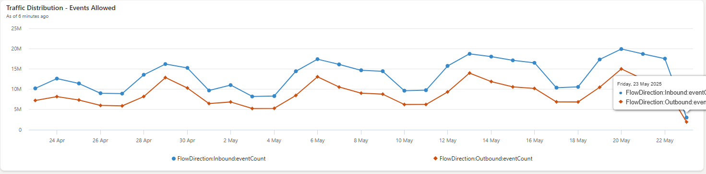
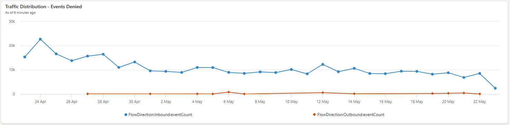
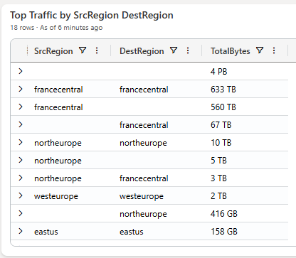
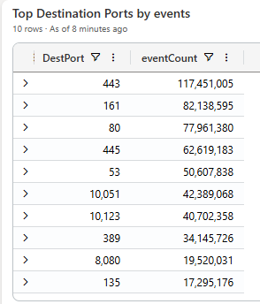
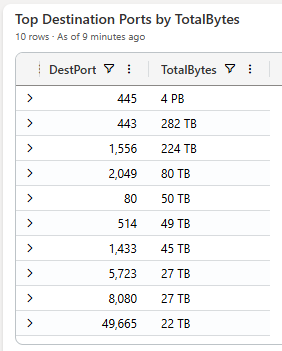
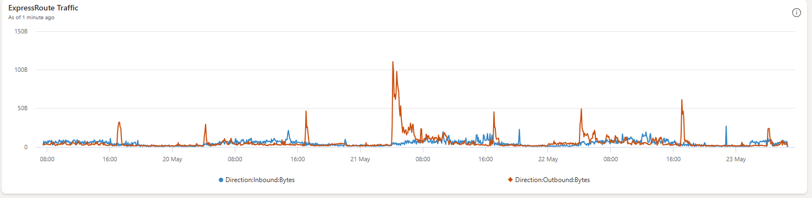
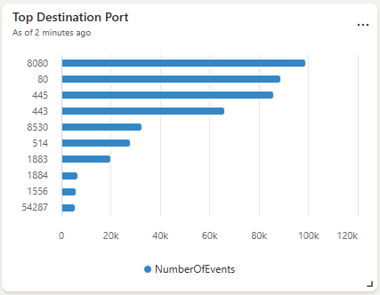

# VNet Flow Logs

Base Query:

```kql
NTANetAnalytics
| where TimeGenerated between (_startTime.._endTime)
| where strlen(DestIp)>0 and strlen(SrcIp)>0
| where ipv4_is_match(_src_ip, SrcIp) or isempty(_src_ip)
| where ipv4_is_match(_dst_ip, DestIp) or isempty(_dst_ip)
| where L4Protocol in (_protocol) or isempty(_protocol)
| where DestPort == _port or isempty(_port)
| where SrcRegion has _src_region or isempty(_src_region)
| where FlowStatus has _flowstatus or isempty(_flowstatus)
```


## Network Traffic 

### Traffic Distribution

```
BaseQuery
| summarize hint.strategy=shuffle TotalBytes = sum(BytesDestToSrc+BytesSrcToDest) by bin(TimeGenerated, totimespan("1d")), FlowDirection
```



```
BaseQuery
| where FlowStatus has "Allowed"
| summarize hint.strategy=shuffle eventCount = count() by bin(TimeGenerated, totimespan("1d")), FlowDirection
```



```
BaseQuery
| where FlowStatus !has "Allowed"
| summarize hint.strategy=shuffle eventCount = count() by bin(TimeGenerated, totimespan("1d")), FlowDirection
```



```
BaseQuery
| summarize hint.strategy=shuffle TotalBytes = sum(BytesDestToSrc+BytesSrcToDest) by SrcRegion, DestRegion
| order by TotalBytes desc 
| extend TotalBytes = format_bytes(TotalBytes, 0)
```



### Network Traffic Allow (Successfull)

Top Source IP:
```
BaseQuery
| where FlowStatus has "Allowed"
| summarize hint.strategy=shuffle TotalBytes = sum(BytesDestToSrc+BytesSrcToDest) by SrcIp
| order by TotalBytes desc 
| limit 10
| extend TotalBytes = format_bytes(TotalBytes, 0)

```

Top Destination IP:
```
BaseQuery
| where FlowStatus has "Allowed"
| summarize hint.strategy=shuffle TotalBytes = sum(BytesDestToSrc+BytesSrcToDest) by DestIp
| order by TotalBytes desc 
| limit 10
| extend TotalBytes = format_bytes(TotalBytes, 0)
```

### Top Destination Ports

Top Destination Ports by events:

```
BaseQuery
| summarize hint.strategy=shuffle  eventCount=count() by DestPort
| sort by eventCount desc 
| limit 10
```



Top Destination Ports by volume (TotalBytes):

```
BaseQuery
| summarize hint.strategy=shuffle  eventCount=count() by DestPort
| sort by eventCount desc 
| limit 10
```



### Internet Traffic

Top 10 - Internet Inbound:

```
BaseQuery
| where FlowDirection has "Inbound"
| extend isLocal=ipv4_is_in_any_range(SrcIp, dynamic(["10.0.0.0/8", "172.16.0.0/12", "192.168.0.0/16"]))
| where isLocal == false
| extend ignoreRange=ipv4_is_in_any_range(SrcIp, dynamic([]))
| where ignoreRange == false
| summarize hint.strategy=shuffle TotalBytes = sum(BytesDestToSrc+BytesSrcToDest) by SrcIp, DestIp
| order by TotalBytes desc 
| limit 10
| extend TotalBytes = format_bytes(TotalBytes, 0)
```

Top 10 - Internet Outbound:

```
BaseQuery
| where FlowDirection has "Outbound"
| extend isLocal=ipv4_is_in_any_range(DestIp, dynamic(["10.0.0.0/8", "172.16.0.0/12", "192.168.0.0/16"]))
| where isLocal == false
| extend ignoreRange=ipv4_is_in_any_range(DestIp, dynamic([]))
| where ignoreRange == false
| summarize hint.strategy=shuffle TotalBytes = sum(BytesDestToSrc+BytesSrcToDest) by SrcIp, DestIp
| order by TotalBytes desc 
| limit 10
| extend TotalBytes = format_bytes(TotalBytes, 0)
```

# DNS Logs

Base Query:
```kql
DNSQueryLogs
| where TimeGenerated between (_startTime.._endTime)
| where ipv4_is_match(_src_ip, SourceIpAddress) or isempty(_src_ip)
| where QueryName contains _query_name or isempty(_query_name)
```

Top 10 QueryName by eventCount:
```kql
BaseQuery
| summarize eventCount = count() by QueryName
| order by eventCount desc 
| limit 10
```

Top 10 QueryName by SourceIpAddress:
```kql
BaseQuery
| summarize eventCount = count() by SourceIpAddress
| order by eventCount desc 
| limit 10
```

Distribution by ResolutionPath:
```kql
BaseQuery
| summarize eventCount=count() by ResolutionPath
| order by eventCount desc
```

Distribution by OperationName:
```kql
BaseQuery
| summarize eventCount=count() by OperationName
| order by eventCount desc
```

Average QueryResponseTime:
```kql
BaseQuery
| summarize avgResponseTime=avg(QueryResponseTime)
```

# ExpressRoute Traffic Collector

Base Query:
```kql
ATCExpressRouteCircuitIpfix
| where TimeGenerated between (_startTime.._endTime)
| where ipv4_is_match(_src_ip, SourceIp) or isempty(_src_ip)
| where ipv4_is_match(_dst_ip, DestinationIp) or isempty(_dst_ip)
| where DestinationPort==_port or isempty(_port)
```

ExpressRoute Traffic Distribution:

```kql
BaseQuery
| extend Direction = iff(DstAsn == 65515, "Inbound", "Outbound")
| summarize Bytes=4096*sum(NumberOfBytes) by bin(TimeGenerated, 5m), Direction
```


Top Destination Port:

```kql
BaseQuery
| summarize hint.strategy=shuffle eventCount=count() by tostring(DestinationPort)
| sort by eventCount
| limit 10
```



Top 10 - Azure => On-prem
```kql
BaseQuery
| where SrcAsn == toint(65515) and DstAsn  != toint(65515)
| summarize hint.strategy=shuffle  TotalBytes=sum(NumberOfBytes) by SourceIp, DestinationIp, Protocol, SourcePort, DestinationPort
| sort by TotalBytes desc
| limit 10
```

Top 10 - On-prem => Azure
```kql
BaseQuery
| where DstAsn == toint(65515) and SrcAsn != toint(65515)
| summarize hint.strategy=shuffle  TotalBytes=sum(NumberOfBytes) by SourceIp, DestinationIp, Protocol, SourcePort, DestinationPort
| sort by TotalBytes desc
| limit 10
```
# Azure Workbook - Subscription parameter

```kql
Table
// filters...
| distinct subscriptionId
| join kind = inner(
  resourcecontainers
  | where type == 'microsoft.resources/subscriptions'
  | project subscriptionId, subscriptionName=name)
  on subscriptionId
```

